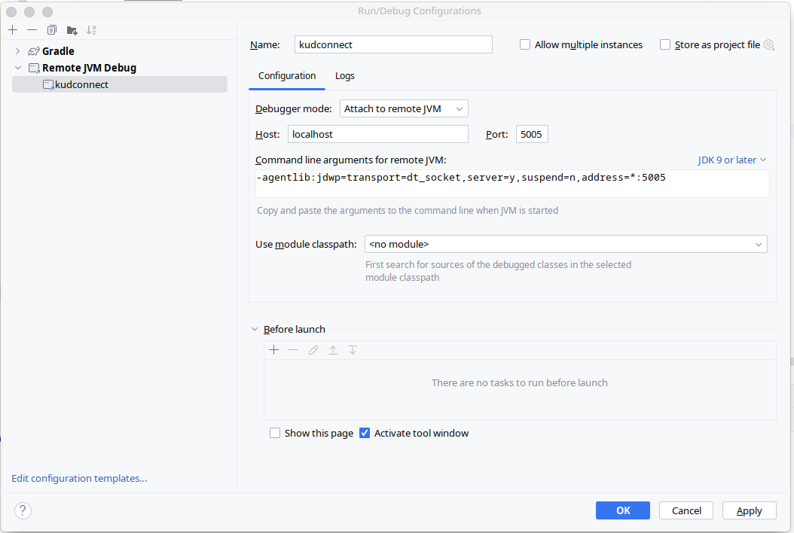

# Local Project Setup

### Build Project

- Publish api specification in maven local repository

```bash
cd kudconnect-service-api
./gradlew publishToMavenLocal
```

- Build Service

```bash
cd kudconnect-service
./gradlew clean build 
```

## Set Environment variables

### Environment variables

To add the environment variables to your `~/.bash_profile` or `~/.zshrc file`, you can use a text editor, or just append them from the command line.

For instance, for Bash:

```bash
echo 'export POSTGRES_USER="myuser"' >> ~/.bash_profile
echo 'export POSTGRES_PASSWORD="mypassword"' >> ~/.bash_profile
```

For Zsh:

```bash
echo 'export POSTGRES_USER="kudconnect"' >> ~/.zshrc
echo 'export POSTGRES_PASSWORD="ctdkucoonn"' >> ~/.zshrc
```

For Linux:

If you are having issues running the app from an **.zsh** env in IntelliJ plese follow the instructions here for **Ubuntu** systems:

- [IntelliJ not picking up environment variables when using ZSH? - Stack Overflow](https://stackoverflow.com/questions/61469797/intellij-not-picking-up-environment-variables-when-using-zsh)
- for **Manajaro** use the same instructions but with another path:
  - ```bash
    /bin/zsh -l -i -c /usr/bin/idea %f
    ```

## Start External Services

Our Service need following services:

- Postgress Database
- Keycloak

For local environment we manage these services with Docker & Docker Compose. For this we added the following plugin:

* [docker-compose-plugin](https://plugins.gradle.org/plugin/com.palantir.docker-compose)

To run the application you have two options:

1. Running the application from the IDE by running the Application main class and start separately the postgres db and keycloak by running docker compose from the local-setup directory:

```bash
docker compose up db keycloak
```
In this case you can debug it directly from your IDE.

2. Running the application with the entire setup, all from Docker containers by simply running:

```bash
docker compose up
```

To kill the containers only run: 
```bash
docker compose down
```

In order to **debug** the application running in the Docker container you need to create a **Remote JVM Debug** configuration like this:



If you make code changes and want to rebuild the app you have to redeploy the Docker container by running:

```bash
docker-compose build --no-cache && docker-compose up -d --force-recreate
```

Keycloak Admin Console can be accessed with this [link](http://127.0.0.1:9080): login:admin | pass:admin
Keycloak will pre-load `kudconnect` realm with following details:
- clientId: kudconnect-webapp

- clientId: kudconnect-client
- roles: ["admin", "user"]
- users:
  - username: admin@test.com, password: admin
  - username: user@test.com, password: user

Example request for obtaining a token from outside the Docker container:

```bash
curl --location 'http://localhost:9080/realms/kudconnect/protocol/openid-connect/token' \
--header 'Content-Type: application/x-www-form-urlencoded' \
--data-urlencode 'grant_type=password' \
--data-urlencode 'client_id=kudconnect-webapp' \
--data-urlencode 'username=admin@test.com' \
--data-urlencode 'password=admin
```

## Start Web Client 

```bash
cd kudconnect-webapp
npm install
npm start
```

- Web Client can be accessed with this [link](http://localhost:3000).

- Web Client will redirect to Keycloak login page. You can login with `admin@test.com` and password `admin`.


If you run the app inside Docker you will have to enter the terminal of the container and run the curl below to obtain the access token:

```bash
curl --location 'http://keycloak:9080/realms/kudconnect/protocol/openid-connect/token' \
--header 'Content-Type: application/x-www-form-urlencoded' \
--data-urlencode 'grant_type=password' \
--data-urlencode 'client_id=kudconnect-client' \
--data-urlencode 'username=user2' \
--data-urlencode 'password=Parola1234-
```

