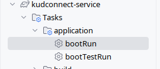

# Local Project Setup

### Build Project

- Publish api specification in maven local repository
```bash
cd kudconnect-service-api
./gradlew publishToMavenLocal
```

- Build Service
```bash
cd kudconnect-service
./gradlew clean build 
```

## Set Environment variables

### Environment variables
To add the environment variables to your `~/.bash_profile` or `~/.zshrc file`, you can use a text editor, or just append them from the command line.

For instance, for Bash:
```bash
echo 'export POSTGRES_USER="myuser"' >> ~/.bash_profile
echo 'export POSTGRES_PASSWORD="mypassword"' >> ~/.bash_profile
```

For Zsh:
```bash
echo 'export POSTGRES_USER="kudconnect"' >> ~/.zshrc
echo 'export POSTGRES_PASSWORD="ctdkucoonn"' >> ~/.zshrc
```

## Start External Services

Our Service need following services:
- Postgress Database
- Keycloak 

For local environment we manage these services with Docker & Docker Compose. For this we added the following plugin:

* [docker-compose-plugin](https://plugins.gradle.org/plugin/com.palantir.docker-compose)

To start the application you need to run the Gradle **bootRun** task which will run the **docker-compose** plugin bringing
the required containers up:



In order to **debug** the application you need to create a **Remote JVM Debug** configuration like this:


Keycloak Admin Console can be accessed with this [link](http://127.0.0.1:9080).
Keycloak will pre-load `kudconnect` realm with following details:
- clientId: kudconnect-webapp
- roles: ["admin", "user"]
- users:
  - username: admin@test.com, password: admin
  - username: user@test.com, password: user

Example request for obtaining a token:

```bash
curl --location 'http://localhost:9080/realms/kudconnect/protocol/openid-connect/token' \
--header 'Content-Type: application/x-www-form-urlencoded' \
--data-urlencode 'grant_type=password' \
--data-urlencode 'client_id=kudconnect-webapp' \
--data-urlencode 'username=admin@test.com' \
--data-urlencode 'password=admin
```

## Start Web Client 

```bash
cd kudconnect-webapp
npm install
npm start
```

- Web Client can be accessed with this [link](http://localhost:3000).

- Web Client will redirect to Keycloak login page. You can login with `admin@test.com` and password `admin`.


