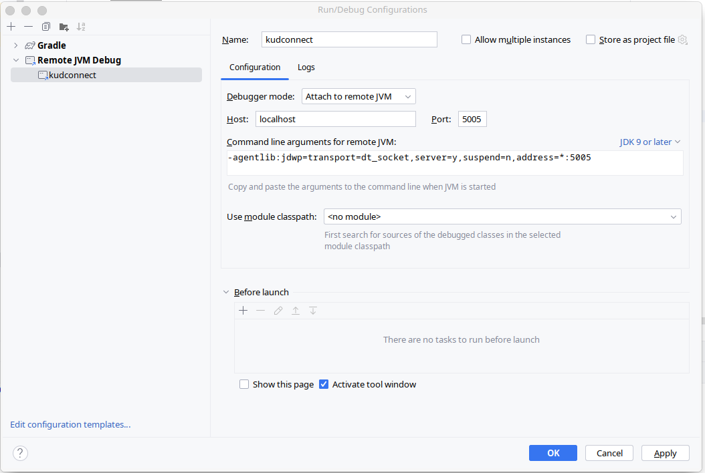

# Local Project Setup

### Build Project

- Publish api specification in maven local repository

```bash
cd kudconnect-service-api
./gradlew publishToMavenLocal
```

- Build Service

```bash
cd kudconnect-service
./gradlew clean build 
```

## Set Environment variables

### Environment variables

To add the environment variables to your `~/.bash_profile` or `~/.zshrc file`, you can use a text editor, or just append them from the command line.

For instance, for Bash:

```bash
echo 'export POSTGRES_USER="myuser"' >> ~/.bash_profile
echo 'export POSTGRES_PASSWORD="mypassword"' >> ~/.bash_profile
```

For Zsh:

```bash
echo 'export POSTGRES_USER="kudconnect"' >> ~/.zshrc
echo 'export POSTGRES_PASSWORD="ctdkucoonn"' >> ~/.zshrc
```

For Linux:

If you are having issues running the app from an **.zsh** env in IntelliJ plese follow the instructions here for **Ubuntu** systems:

- [IntelliJ not picking up environment variables when using ZSH? - Stack Overflow](https://stackoverflow.com/questions/61469797/intellij-not-picking-up-environment-variables-when-using-zsh)
- for **Manajaro** use the same instructions but with another path:
  - ```bash
    /bin/zsh -l -i -c /usr/bin/idea %f
    ```

## Start External Services

Our Service need following services:

- Postgress Database
- Keycloak

For local environment we manage these services with Docker & Docker Compose. For this we added the following plugin:

* [docker-compose-plugin](https://plugins.gradle.org/plugin/com.palantir.docker-compose)

To start the application you need to run the Gradle **bootRun** task which will run the **docker-compose** plugin bringing
the required containers up:


In order to **debug** the application you need to create a **Remote JVM Debug** configuration like this:



Keycloak Admin Console can be accessed with this [link](http://127.0.0.1:9080): login:admin | pass:admin
Keycloak will pre-load `kudconnect` realm with following details:

- clientId: kudconnect-client
- roles: ["admin", "user"]
- users: ["globaladmin", "user1", "user2"] (all of them has password: `Parola1234-`)

Example request for obtaining a token:

```bash
curl --location 'http://localhost:9080/realms/kudconnect/protocol/openid-connect/token' \
--header 'Content-Type: application/x-www-form-urlencoded' \
--data-urlencode 'grant_type=password' \
--data-urlencode 'client_id=kudconnect-client' \
--data-urlencode 'username=user2' \
--data-urlencode 'password=Parola1234-
```
